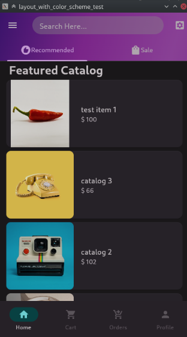
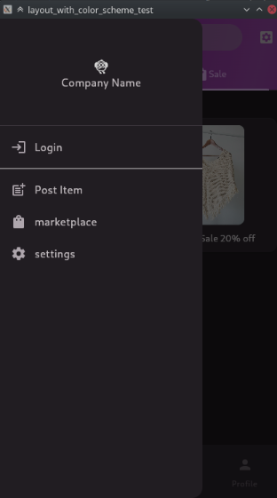
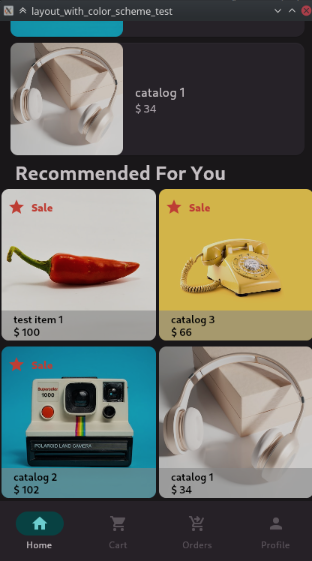
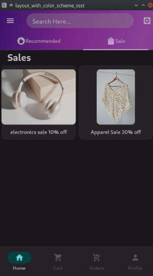
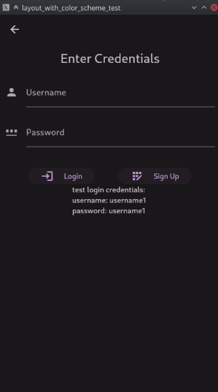
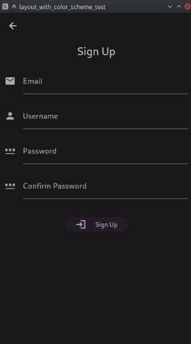
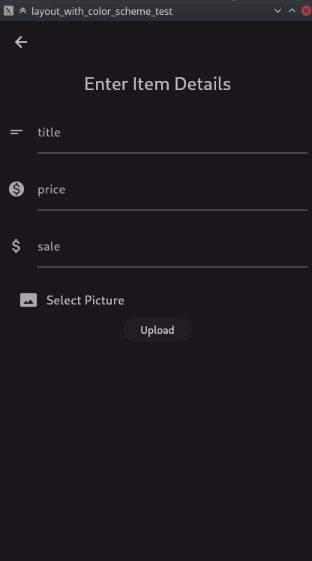
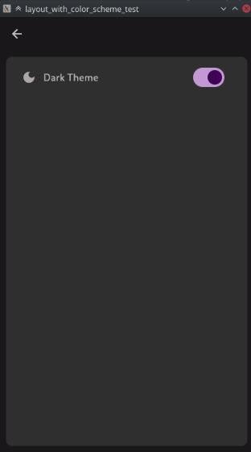
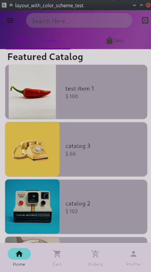

# flutter_marketplace_test

A marketplace test Flutter project using pocketbase as a backend. 

# For running the project
download pocketbase and extract pocketbase executable into the pocketbace directory. 
run the command "./pocketbase serve" to run the backend server before starting the application. 

run Flutter on your preferred platform and see the api results. 

